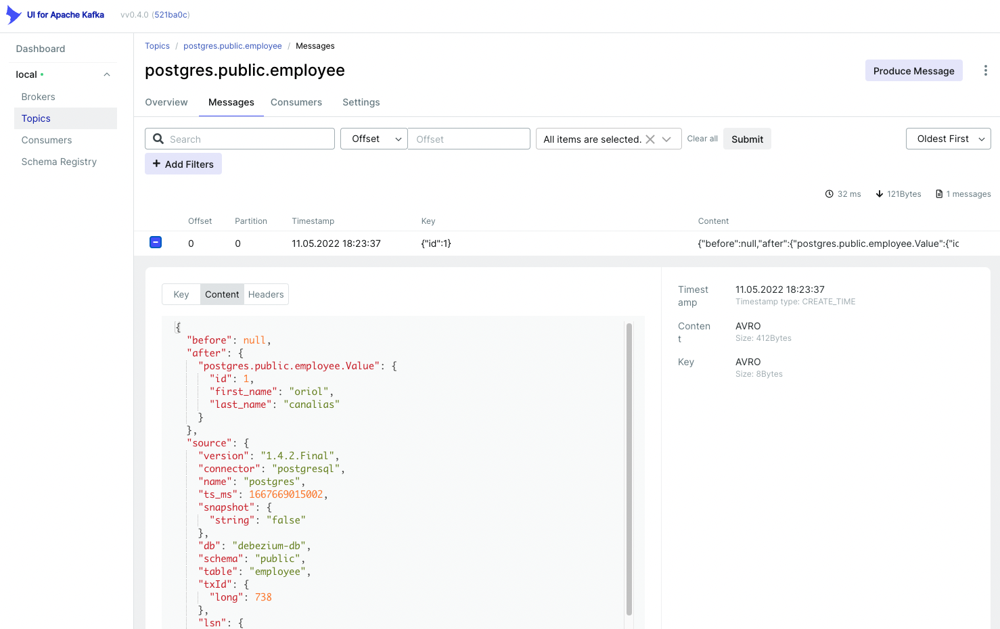

# Learning Debezium

Debezium is an open source distributed platform for change data capture (CDC). It connects to databases, and stream changes using Kafka.

_note_: This is a sample, is not a deep repo about debezium 

## Run environment

Docker compose on this repo has kafka, zookeeper, schema-registry, schema-registry-ui and kafka-ui. Apart from that, docker compose has the debezium connect, who will take care to connect to database in order to "listen" modifications, and the database itself.

```shell
docker-compose up -d
```
_note_: Database is configured as `logical` (see docker-compose.yml).

After this, we can create a database:
```shell
docker exec -it debezium-postgres-db psql -U debezium-user -d debezium-db
```
`debezium-user` and `debizium-db` is configured on docker compose
```shell
psql (14.5 (Debian 14.5-1.pgdg110+1))
Type "help" for help.

debezium-db=# CREATE TABLE EMPLOYEE(id serial PRIMARY KEY, first_name varchar(150) not null, last_name varchar (150) not null);
CREATE TABLE
```

Now, we can add the connector to debezium. We can add this json:
```json
{
    "name": "postgres-connector",
    "config": {
        "connector.class": "io.debezium.connector.postgresql.PostgresConnector",
        "plugin.name": "pgoutput",
        "database.hostname": "postgres",
        "database.port": "5432",
        "database.user": "debezium-user",
        "database.password": "debezium-password",
        "database.dbname": "debezium-db",
        "database.server.name": "postgres",
        "snapshot.mode": "always",
        "table.include.list": "public.employee"
    }
}
```
Now, we can add to debezium using curl, passing the json as data or file:
```shell
curl -i -X POST -H "Accept:application/json" -H "Content-Type:application/json" localhost:8083/connectors/ --data "@connector.json"
```
If we add informations to the table, these will be publish on the topic.



---
## References

- https://medium.com/kargo-engineering/how-to-do-cdc-with-debezium-and-kafka-b2244ed98605
- https://debezium.io/